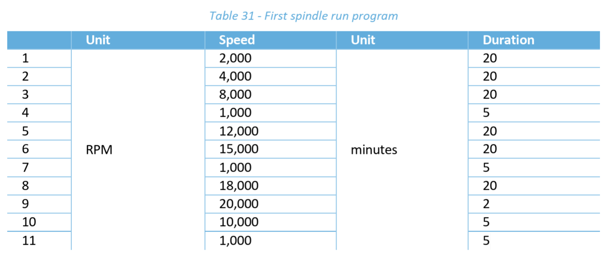

#DRAFT 
This is a work in progress

# Syil X7 warmup and breakin routines.  
Warmup and breakin routines for the Syil X7 running the Siemens Sinumerik 828D controller.  

NOTE: use at your own risk and we assume no responsibility for your crashed machine.

# Breakin Requirements - First Spindle Run - Run-In
The following routine is a breakin routine in the SYl X7 User Guide.  
See User Manual section 25.17 for a list of each

[Break In / Run In Program](FIRST_SPINDLE_RUN_IN.MPF)

# Warmup Routine
Before using the machine each day the spindle requires a warmup procedure.  Our procedure uses the recommended spindle speeds and times stamped on the front of the spindle.  In addition we run a pattern on the X and Y (table) to warm up the other motors.  The following routines are for idle time that has passed since last using the machine.  

## Daily Warmup program
[Daily Program](DAILY.MPF)

## 72 Hours since last run
[72 Hours Idle Program](IDLE_72_HOURS.MPF)

## 2 weeks idle
[2 Weeks Idle Program](IDLE_2_WEEKS.MPF)

# INSTALL STEPS
1. Copy the [WARMUP_CYCLE.SPF](subroutines/WARMUP_CYCLE.SPF) file to the SubRoutines folder on your Siemens Controller
2. Copy each main program (.MPF) onto the Siemens controller
